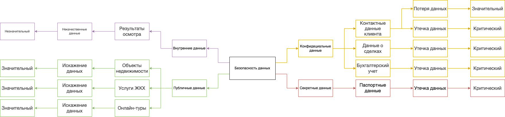

# Проверочный лист по безопасности данных.

Классификация данных по станддартам ISO/IEC 27001 и 27002

|Данные|Классификация|Риски|Оценка|
|------|-------------|-----|------|
|Паспортные данные|Секретные|Утечка данных. Нарушение законодетельства, финансовые и репутационные потери|Критический|
|Контактные данные клиента|Конфиденциальные|1. Утечка данных. Возможность проводить мошеннические операции над клиентами приведет к репутационным и финансовым потерям 2. Потеря данных. Может привести к дополнительным работам по возобновлению|1. Критический 2. Значительный
|Данные о сделках|Конфиденциальные|Утечка данных. Возможность проводить мошеннические операции над клиентами приведет к репутационным и финансовым потерям|Критический
|Бухгалтерский учет|Конфидециальные|Утечка данных. Финансовые и репутационные потери|Критический|
|Результаты осмотра|Внутренние|Некачественные данные. Обесценивание данных. Это те данные, на основании которых можно будет построить аналитику. Чем точнее и подробней заполнены эти отчеты, тем лучше для будущего развития компании|Незначительный|
|Объекты недвижимости|Публичные|Искажение данных. Информация должны быть актуальной|Значительный|
|Услуги ЖКХ|Публичные|Искажение данных. Информация должны быть актуальной|Значительный|
|Онлайн-туры|Публичные|Искажение данных. Информация должны быть актуальной|Значитальный|

# Итоговый mindmap

