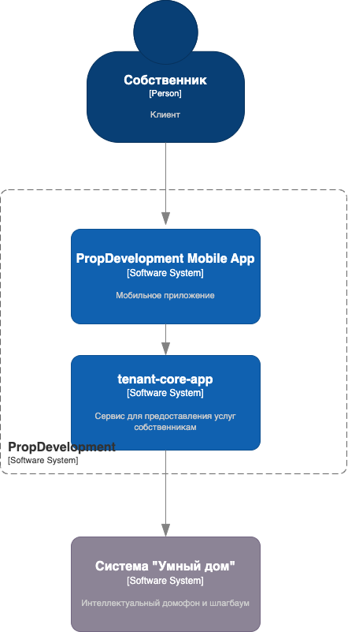
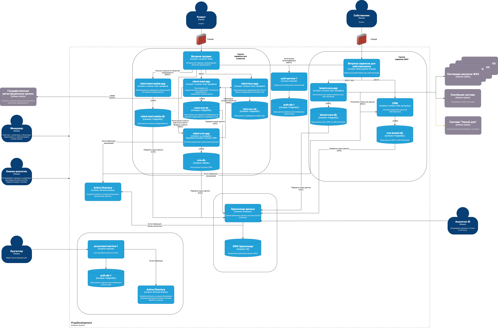

# Требования к безопасности с внешними интеграциями

- Нужно использовать зашифрованный канал связи - HTTPS
- Передавать только необходимые данные во внешние сервисы
- Использовать протокол аутентификации OAuth 2.0
- Шифровать передаваемые биометрические данные в систему "Умный дом"

## Контекстная диаграмма

Отображает взаимодействие собственника с системой "Умный дом"

## Диаграмма контейнеров

Обновленная диаграмма контейнеров
